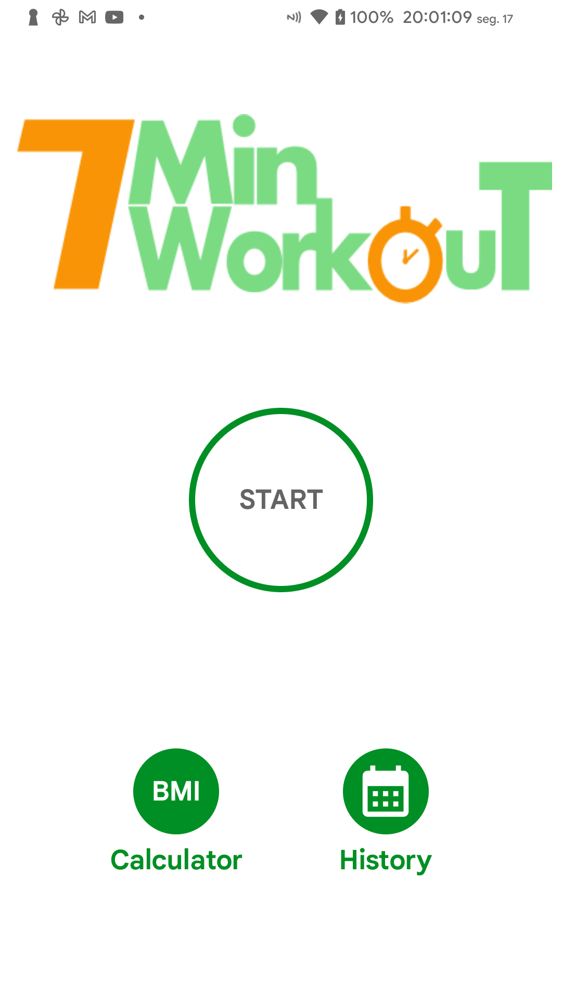
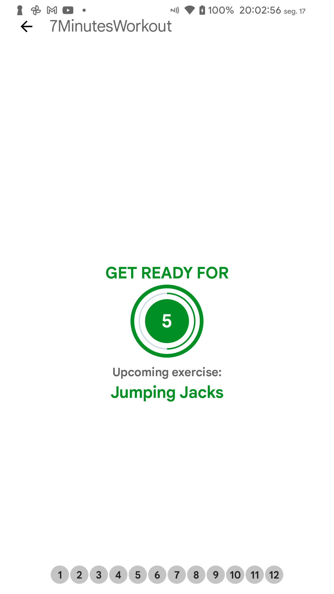
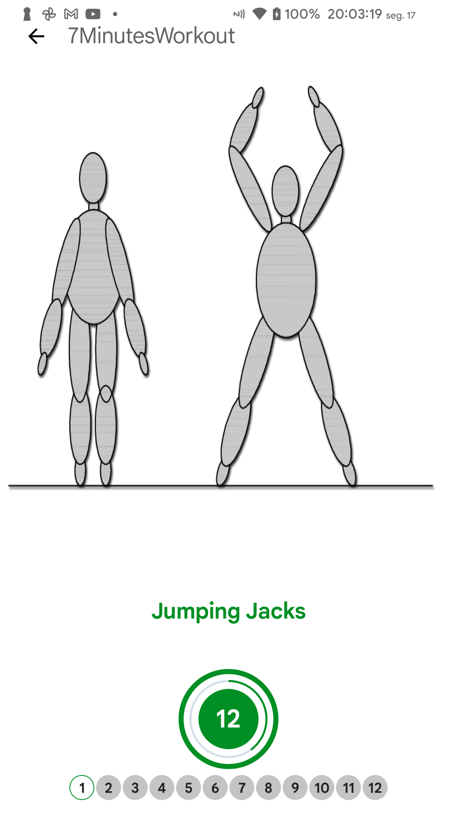
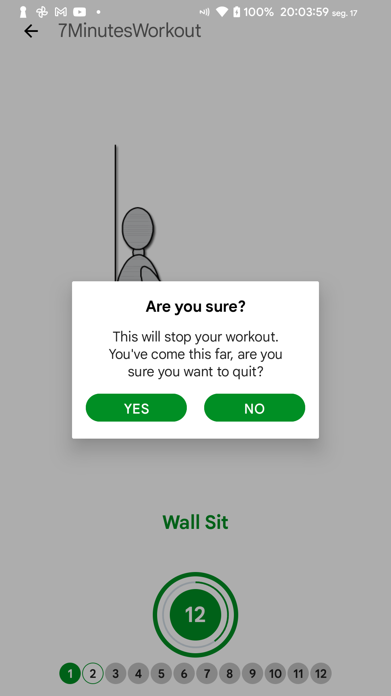
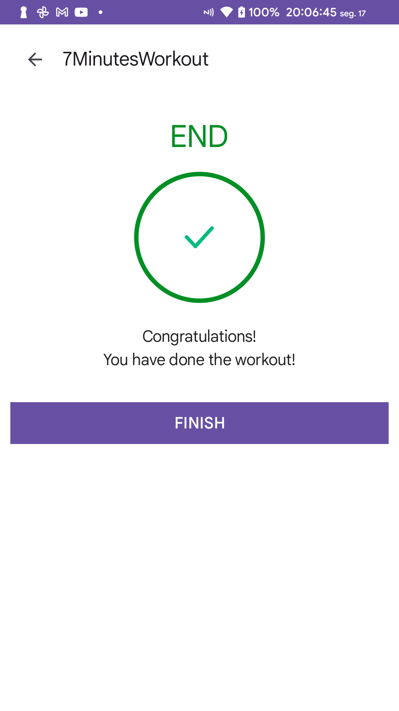
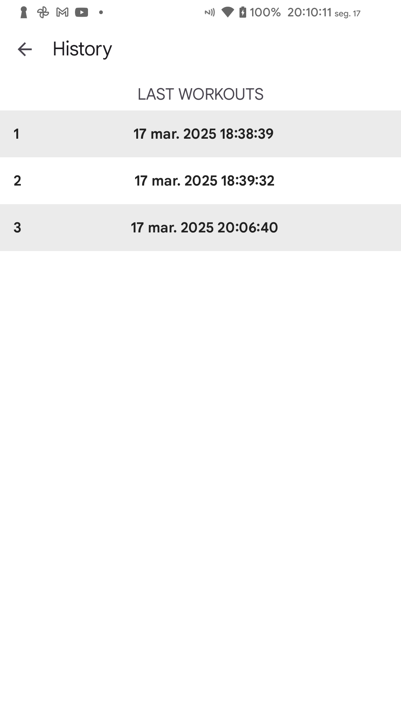
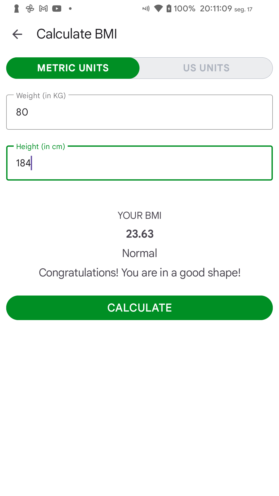
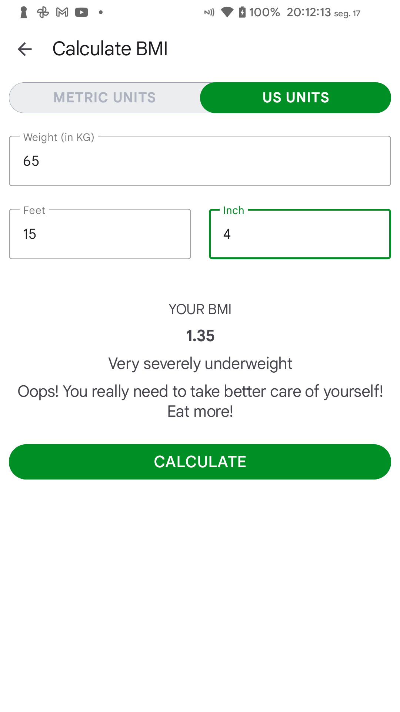

# 7MinutesWorkout
Aplicativo Android de exercícios físicos

## Objetivo
Realizar os treinos diariamente e manter salvo o histórico de treinos, além de conferir o Índice de Massa Corporal.

## Funcionalidades
- Realizar treino e manter salvo no dispositivo
- Visualizar histórico de treinos
- Calcular o Índice de Massa Corporal

## Linguagem
- Kotlin 
- XML

## Framework
- Room Database

## Screenshots
       
